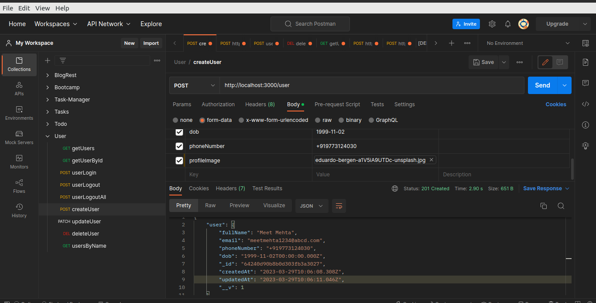

# devstree-practicaltest

To Run this project run **npm i to insatll** all the dependencies.

created userModel using mongoose schema which takes fullName, email, password, phoneNumber, dob, profileImage from user.

also created auth middleware which has jwt token to protect routes and implemented login, logout, functionality.

made seprate route file, middleware, db, and app.js file.

used jsonwebtokens on multiple sessions 

**creted all the api's endpoint in routes folder** 

**and also commented out all the explanation in code.**

- Registration API :
route in route file to register new user also implemented validation like password length min(6)
Email type must be mail format and unique timestamps feature

 
 - Login API :
 Users can log in using (Email & Password) with validation on user login also implemented logout and logoutfromall devices functionality.

- login we will get Profile Details API (via JWT auth route, otherwise it will throw user not authorized)

- User List API with filters like search by name(via JWT auth route, otherwise it will throw user not authorized) /userByName route

below are all the routes for user

